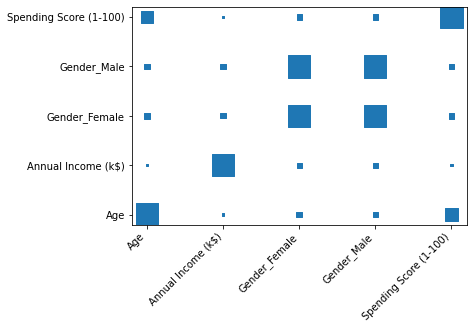

# COSTUMER CLUSTERING WITH K-MEANS

Bu projede bir alışveriş merkezinin müşterileri k-means yöntemi ile benzerliklerine göre kümelendirilmeye çalışılmıştır.

## KURULUMLAR

**Python --version 3.9.13**

```
pip install pandas
pip install numpy
pip install scikit-learn
pip install matplotlib
--version 3.9.13
```

## İÇİNDEKİLER

- [COSTUMER CLUSTERING WITH K-MEANS](#costumer-clustering-with-k-means)
  - [KURULUMLAR](#kurulumlar)
  - [İÇİNDEKİLER](#i̇çi̇ndeki̇ler)
  - [YÖNTEM](#yöntem)
  - [UYGULAMA](#uygulama)
  - [SONUÇ](#sonuç)
  - [REFERANSLAR](#referanslar)

## YÖNTEM

Bu ödev kapsamında bir AVM’ye gelen müşterilerin bilgilerini içeren veri seti üzerinde 
çalışılmıştır. Veri setimiz 200 kişi ve bu kişilere ait id_numarası, cinsiyet, yaş, yıllık_kazanç ve 
harcama_skoru bilgilerinden oluşmaktadır. Yıllık kazanç dolar türümden verilmiştir. Harcama 
skoru değeri de alışveriş merkezi tarafından müşteri davranışına ve harcama niteliğine göre 
atanmış puanları ifade etmektedir.
Veri seti üzerinde ilk olarak eksik veri kontrolü yapılmıştır. Bu aşamada herhangi bir eksik veri 
olmadığı tespit edilmiştir. Veri setinde bulunan cinsiyet özelliği string türünden verilmiştir.
Sayısallaştırma işlemi uygulanarak bu özellik sayısal türe çevrilmiştir. Daha sonra veri setinde 
bulunan id_numarası veri setinden çıkarılmıştır. Çünkü bu özellik her kullanıcıya özel 
belirlenmiş ve ayır ediciliği olmayan bir özelliktir.
Bu aşamada oluşan veri seti üzerinde özellikler için korelasyon kat sayıları heatmap’i 
çizilerek yüksek korelasyona sahip olduğu özelliklerin olup olmadığı incelenmiştir.


Heatmap yapısı incelendiğinde One Hot Encoding uygulanarak elde edilen 
Gender_Female ve Gender_Male özellikleri arasında yüksek korelasyon tespit edilmiştir. Bu 
noktada Gender_Male özelliği veri setinden çıkarılmıştır.



Yüksek korelasyonlu özelliklerden arındırılmış veri seti üzerinde Min Max Scaler işlemi 
uygulanarak verimiz normalize edilmiştir.

Bu noktada veri setinin hazırlanması aşaması tamamlanarak K-means modeli için en 
uygun k değerinin belirlenmesi işlemine geçilmiştir. En uygun k değeri ile oluşturulan K-means 
kümele işlemi görselleştirilmiştir. Aynı işlem hata değeri yüksek 2 adet k değeri ile 
tekrarlanarak elde edilen sonuçlar karşılaştırılmıştır.

## UYGULAMA

Bu aşamada farklı k değerlerine karşılık WCSS (within clusters sum of errors) değerinin 
değişimi çizdirilmiştir. Çizdirilen grafik üzerinde Elbow yöntemi ile en uygun k değerinin 
gösterilmiştir.


Elbow yöntemi ile k değeri belirleme sonucunda belirlenen k değeri K-means yapısına 
verilerek kümele işlemi yapılmıştır. Görselleştirme işlemi için Annual_Income ve Spending_Score özellikleri seçilmiştir. Elde edilen kümeleme işleminin görselleştirilmiş halini 
Resim-5’te görmemiz mümkündür.


Hata değeri yüksek iki k değeri olarak 2 ve 7 seçilmiştir. Bu k değerlerine göre yapılan 
kümele işlemi Resim-6 ve Resim-7’de gösterilmiştir.


## SONUÇ

Bu ödev kapsamında ilk olarak veri üzerinde eksik veri kontrolü, sayısallaştırma ve 
normalizasyon veri ön işlem adımları uygulanarak verimiz kullanılabilir hale getirilmiştir. Daha 
sonra Elbow yöntemi ile K-means için en uygun k değeri belirlenerek bu değer ile en optimum 
kümele işlemi gerçekleştirilmiştir. Optimum k değeri ile gerçekleştirilen kümeleme işlemi 
grafik üzerinde incelendiğinde ilk bakışta 5 adet küme varmış gibi gözükse de hesaplamalar 
sonucunda en az hatanın 4 adet küme değeri ile alındığı gözlemlenmiştir. Yüksek hata 
değerlerine sahip k değerleri ile yapılan kümeleme grafikleri incelendiğinde de gerçek anlamda 
yanlış kümeleme değerleri olduğunu görmemiz mümkündür. Sonuç olarak bu veri seti üzerinde 
optimum k değeri bulunarak gerçekleştirilen kümeleme işleminin başarılı bir şekilde 
tamamlandığını söylemek mümkündür.

## REFERANSLAR

Sinaga, K. P., & Yang, M. S. (2020). Unsupervised K-means clustering algorithm. IEEE access, 8, 
80716-80727.

Humaira, H., & Rasyidah, R. (2020, January). Determining the appropiate cluster number using Elbow 
method for K-Means algorithm. In Proceedings of the 2nd Workshop on Multidisciplinary and 
Applications (WMA).

[Dataset Link](https://www.kaggle.com/datasets/vjchoudhary7/customer-segmentation-tutorial-in-python)

